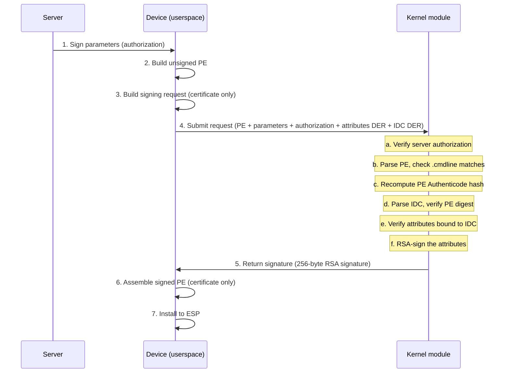
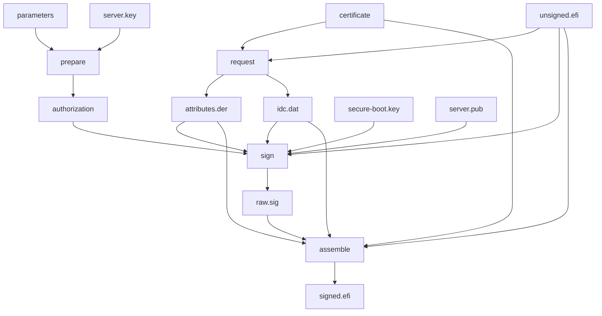

# Kernel Command-Line Signer

Signs UKI addon PE binaries containing kernel command-line
parameters with server authorization. The private signing
key is protected from root by running inside a kernel
module where kernel lockdown prevents access to kernel
memory.

## Overview

The server authorizes a kernel command-line change by
signing the parameters string. The device builds an
unsigned PE addon, prepares a signing request, has the
kernel module verify and sign it, then assembles the
final Secure Boot signed PE addon.



<!--
For terminal/vim users, here is the same diagram in ASCII:

Server                Device (userspace)       Kernel module
  |                         |                       |
  | 1. Sign parameters      |                       |
  |------------------------>|                       |
  |   (authorization)       |                       |
  |                         |                       |
  |                   2. Build unsigned PE          |
  |                   3. Build signing request      |
  |                      (certificate only,         |
  |                       no private key)           |
  |                         |                       |
  |                         | 4. Submit request     |
  |                         |---------------------->|
  |                         |   PE + parameters     |
  |                         |   + authorization     |
  |                         |   + attributes DER    |
  |                         |   + IDC DER           |
  |                         |                       |
  |                         |   Kernel module:      |
  |                         |   a. Verify server    |
  |                         |      authorization    |
  |                         |   b. Parse PE, check  |
  |                         |      .cmdline matches |
  |                         |   c. Recompute PE     |
  |                         |      Authenticode     |
  |                         |      hash             |
  |                         |   d. Parse IDC, verify|
  |                         |      PE digest        |
  |                         |   e. Verify attributes|
  |                         |      bound to IDC     |
  |                         |   f. RSA-sign the     |
  |                         |      attributes       |
  |                         |                       |
  |                         | 5. Receive signature  |
  |                         |<----------------------|
  |                         |    (256-byte RSA)     |
  |                         |                       |
  |                   6. Assemble signed PE         |
  |                      (certificate only,         |
  |                       no private key)           |
  |                         |                       |
  |                   7. Install to EFI             |
-->

## Why four programs?

The pipeline is split to enforce key separation:

- **prepare** and **request** never touch the private key
- **sign** is the only program that uses the private key
- **assemble** never touches the private key

This means the `sign` step can run inside a kernel module
where the key is protected by kernel lockdown, while the
other three steps run in userspace with full access to
OpenSSL and sbsign's PE/Authenticode code.

## Programs

### prepare (server)

Signs SHA-256 of the kernel parameters string with the
server's private key. Produces an authorization file
that the device sends to the kernel module.

```
puavo-command-line-sign-prepare <parameters> \
    <server-private-key> <authorization-output>
```

### request (userspace, no private key)

Builds the signing request from an unsigned PE addon
and the Secure Boot certificate. Computes the PE
Authenticode hash, builds the IDC and authenticated
attributes, and outputs them as DER files.

```
puavo-command-line-sign-request <unsigned.efi> \
    <certificate> <attributes-output> <idc-output>
```

### sign (kernel module or userspace)

Verifies the server authorization, validates the PE
content, and RSA-signs the authenticated attributes
with the Secure Boot private key.

Three modes:

- `--user` signs using OpenSSL directly (non-encrypted
  devices)
- `--kernel` signs via the kernel module ioctl
  (encrypted devices)
- `--load-keys` provisions PKCS#1 DER keys into the
  kernel module

```
puavo-command-line-sign --user <unsigned.efi> \
    <parameters> <authorization> \
    <server-public-key> <secure-boot-private-key> \
    <attributes> <idc> <signature-output>

puavo-command-line-sign --kernel <unsigned.efi> \
    <parameters> <authorization> \
    <attributes> <idc> <signature-output>

puavo-command-line-sign --load-keys \
    <server-public-key.der> \
    <secure-boot-private-key.der>
```

### assemble (userspace, no private key)

Takes the raw RSA signature from the kernel module,
injects it into a PKCS7 structure along with the
authenticated attributes and IDC, and embeds the
result into the PE binary.

```
puavo-command-line-sign-assemble <unsigned.efi> \
    <certificate> <attributes> <idc> \
    <signature> <signed.efi>
```

## Data flow



<!--
For terminal/vim users, here is the same diagram in ASCII:

                   server.key
                       |
                       v
    parameters --> [prepare] --> authorization
                                     |
                                     v
unsigned.efi --+--> [request] --> attributes.der
               |        |             |
  certificate -+--------+------+     |
               |        |      |     v
               |        v      |   [sign] --> raw.sig
               |    idc.dat ---+     ^           |
               |        |      |     |           |
               |        |      |  secure-boot.key|
               |        |      |  server.pub     |
               |        v      v                 v
               +----> [assemble] <------------- raw.sig
                          |
                          v
                    signed.efi
-->

## Building

```
make userspace   # userspace tools only
make modules     # kernel module only
make all         # both userspace and kernel module
```

## Testing

```
scripts/generate-keys   # one time, creates keys/
make test               # userspace backend
```

For kernel module testing:

```
make all
sudo scripts/load-kernel-module \
    keys/server.pub keys/secure-boot.key
scripts/test --kernel
```

Keys are stored persistently in `keys/` and reused
across test runs. The `load-kernel-module` script
converts PEM keys to PKCS#1 DER on the fly.

## Kernel module details

The kernel module (`puavo_command_line_signer.ko`)
exposes `/dev/puavo-command-line-signer`. Userspace
submits signing requests via ioctl.

Keys are provisioned at runtime via the `LOAD_KEYS`
ioctl in PKCS#1 DER format. The module does not accept
signing requests until keys have been loaded. Boot
Trust Manager loads the module and provisions the
keys during early boot via the
`CommandLineSignerConfigurator`.

The Secure Boot private key is protected by kernel
lockdown which blocks:

- `/dev/mem` and `/dev/kmem` access
- `/proc/kcore` access
- kprobes and tracing of kernel functions
- Loading unsigned kernel modules
- BPF writes to kernel memory

This means root cannot extract the key even though it
is present in kernel memory.

### Architecture of sign/

```
core.h              Crypto backend interface
core.c              Verification pipeline
pe.h                PE format structures
der.h / der.c       DER parser
authenticode.h / authenticode.c
                    IDC and attributes parsing
log.h               Logging macros
sign.c              CLI dispatcher
user_backend.h / user_backend.c
                    OpenSSL crypto backend
kernel_client.h / kernel_client.c
                    Kernel module ioctl client
kernel_module.c     Kernel crypto backend + ioctl
ioctl.h             Shared ioctl definitions
```

`core.c` contains no OS-specific code. It uses
three crypto operations defined in `core.h`:

- `sha256(data, length, output)`
- `rsa_verify(key, data, signature)`
- `rsa_sign_digest(key, digest, signature_output)`

The userspace backend (`user_backend.c`) implements
these using OpenSSL's EVP API. The kernel backend
(`kernel_module.c`) implements them using
`crypto_shash` for SHA-256 and `crypto_sig` with
`pkcs1pad(rsa,sha256)` for RSA operations.

## Scripts

- `scripts/generate-keys` generates persistent test
  keys in `keys/`
- `scripts/load-kernel-module` loads the module and
  provisions PEM keys (converts to DER on the fly)
- `scripts/setup` fetches and patches sbsigntools
- `scripts/test` runs the end-to-end test suite

## Formatting

```
make format
```

Applies `.clang-format` to all C sources.
